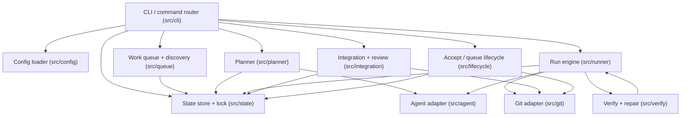
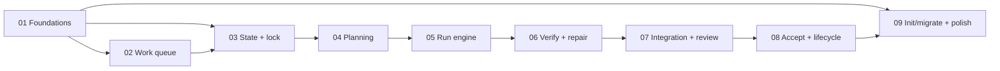

# Lupe Build Plan

Phased development roadmap for building **Lupe**, an ordered implementation
queue for agentic development. This directory turns the product scope in
[../scope.md](../scope.md) into a sequenced set of build phases.

Each phase is a self-contained, shippable increment with its own goal, task
checklist, acceptance criteria, and verification steps. Read them in order;
later phases assume the modules from earlier ones exist.

## Product summary

Lupe is a CLI that reads user-authored markdown **work items** from an ordered
input directory (`lupe-queue/`), breaks each into build **phases**, runs Cursor
agent loops to implement them, verifies the result, integrates the work through
git branches, and produces a review package (and a PR) before advancing to the
next item.

- **Input:** `lupe-queue/` — timestamp-ordered, user-authored work items.
- **Internal state/output:** `.lupe/` — canonical `state.json`, generated
  `STATE.md`, per-work-item plans, runs, and review packages.
- **Contract:** user intent lives in `lupe-queue/`; everything Lupe generates
  lives in `.lupe/`.

## Tech stack

- **Language:** TypeScript (strict).
- **Runtime / tooling:** Bun (`bun run typecheck`, `bun test`, `bun run lint`).
- **Agent:** Cursor (agent + subagents) for planning and phase execution.
- **VCS integration:** git branches/worktrees plus a PR provider (e.g. `gh`).

## Target architecture

## Glossary

- **Work item:** a single user-authored markdown file in `lupe-queue/`
  describing a unit of intent (scope, feature, bug, refactor, etc.). Identified
  by its `YYYYMMDDThhmmss_description` prefix.
- **Phase:** a planner-generated unit of work *within* a work item, with
  dependencies, its own branch/worktree, and verification.
- **Run:** one execution attempt of a work item, stored append-only under
  `.lupe/work-items/<id>/runs/run-NNN/`.
- **Integration branch:** `lupe/<work-item-id>`, where verified phases are
  merged before review/PR.
- **Review package:** the generated `final-review/` artifacts a user inspects
  before accepting a work item.
- **State:** canonical machine-readable truth in `.lupe/state.json`, rendered
  to the human-readable `.lupe/STATE.md`.

## Phase map

| Phase | File | Theme |
|-------|------|-------|
| 01 | [phase-01-foundations.md](phase-01-foundations.md) | Project scaffold, CLI router, config, directory contract |
| 02 | [phase-02-work-queue.md](phase-02-work-queue.md) | Queue discovery, filename parsing, work-item model |
| 03 | [phase-03-state-and-locking.md](phase-03-state-and-locking.md) | `state.json`, `STATE.md`, lock, state machine |
| 04 | [phase-04-planning.md](phase-04-planning.md) | `lupe plan`, phase graph, agent planning |
| 05 | [phase-05-run-engine.md](phase-05-run-engine.md) | `lupe run`, branches/worktrees, parallelism, resumability |
| 06 | [phase-06-verify-and-repair.md](phase-06-verify-and-repair.md) | Verify commands, bounded repair loop |
| 07 | [phase-07-integration-and-review.md](phase-07-integration-and-review.md) | Integration branch merge, final-review package |
| 08 | [phase-08-accept-and-queue-lifecycle.md](phase-08-accept-and-queue-lifecycle.md) | Accept/PR, reject/skip, halt, immutability |
| 09 | [phase-09-init-migrate-and-polish.md](phase-09-init-migrate-and-polish.md) | `init`/`migrate`/`new`, skills, packaging |

## Build order and dependencies

## Scope-to-phase traceability

| Scope section | Phase(s) |
|---------------|----------|
| Directory Convention, Validation | 01, 02 |
| Input Model, Work Item Files | 02 |
| File Naming, Processing Order | 02 |
| Work Item Lifecycle (state machine) | 03, 08 |
| State Tracking, Concurrency (lock) | 03 |
| Phase Planning Per Work Item | 04 |
| Resumability, Internal Artifact Layout | 05 |
| Config (`verify`, repair, parallelism) | 01, 05, 06 |
| Accept / Merge Contract | 07, 08 |
| Reject Policy | 08 |
| Review Model (`per-item` / `batch`) | 07 |
| Immutability Rule, `acknowledge` | 08 |
| Init Flow, Migration, Commands | 09 |

## Testing strategy

- **Unit tests:** per module (queue parsing, state transitions, config
  validation, filename matching). Pure functions kept side-effect free for easy
  testing.
- **Integration tests:** run engine against a temp git repo with a fake/mock
  agent adapter; assert branch/worktree creation, run artifacts, and state
  updates.
- **End-to-end tests:** seed a sandbox `lupe-queue/`, drive `init -> plan ->
  run -> verify -> accept`, and assert the resulting `.lupe/` tree and PR call.
- **Determinism:** the agent and git adapters are interfaces so tests can inject
  deterministic fakes.

## Milestones

- **MVP (phases 01-06):** discover a work item, plan it, run phases in git
  worktrees, verify, and repair — single item, no PR yet.
- **v1 (phases 01-09):** full lifecycle including integration, review packages,
  accept/PR, halt-on-reject, immutability, and the `init`/`migrate`/`new`
  onboarding commands.

## Conventions used in each phase file

Every phase doc follows the same template:

- **Goal** — the outcome in one paragraph.
- **Scope** — what is in, and what is explicitly out.
- **Key modules / files** — proposed source paths.
- **Tasks** — an ordered checklist.
- **Acceptance criteria** — testable conditions for "done".
- **Verification** — commands/tests that prove the phase works.
- **Dependencies** — required earlier phases.
