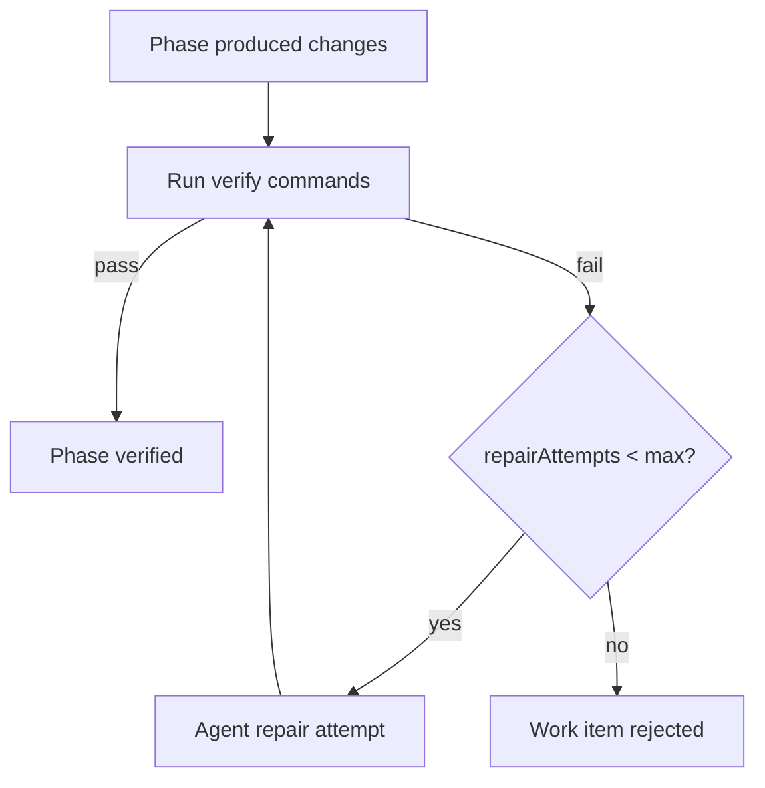

# Phase 06 — Verify & Repair

## Goal

Close the run loop with verification and bounded repair. After a phase produces
changes, Lupe runs the configured `verify` commands; on failure it triggers a
bounded repair attempt via the agent and re-verifies. When all phases verify the
item becomes `verified`; when the repair budget is exhausted the item becomes
`rejected`. This completes the MVP (phases 01-06).

## Scope

In:

- Execute `verify` commands (e.g. `bun run typecheck`, `bun test`,
  `bun run lint`) in the phase worktree; capture output to `verification.md`.
- Bounded repair loop driven by `maxRepairAttempts`.
- Transitions: `running -> verified` (all pass), `running -> running` (repair),
  `running -> rejected` (budget exhausted).

Out:

- Merging verified phases into the integration branch (Phase 07).
- The user-facing `reject`/halt policy semantics (Phase 08) — this phase only
  drives the automatic rejected-on-exhaustion transition.

## Key modules / files

```txt
src/verify/run.ts          # execute verify commands, capture results
src/verify/repair.ts       # bounded repair loop (agent re-attempt)
src/verify/report.ts       # write verification.md + summarize failures
```

## Repair loop



## Tasks

1. Implement verify execution: run each configured command in the phase
   worktree, capture exit code + stdout/stderr, and stop early on first failure
   (configurable) while recording results.
2. Write `verification.md` into the active `run-NNN/` with a clear pass/fail
   summary per command.
3. Implement the repair loop: on failure, feed the failing output back to the
   agent for a bounded number of attempts (`maxRepairAttempts`), re-verifying
   after each.
4. Track `repairAttempts` per work item in `state.json`.
5. Wire transitions: all phases pass -> `verified`; budget exhausted ->
   `rejected` (which Phase 08 will turn into a queue halt).
6. Integrate the loop with the Phase 05 post-phase hooks so verify/repair runs
   automatically during `lupe run`.
7. Ensure failures preserve artifacts and produce actionable summaries.

## Acceptance criteria

- Verify commands run in the worktree; results are captured to
  `verification.md`.
- A failing verify triggers up to `maxRepairAttempts` repair attempts, then
  stops.
- All phases passing transitions the item to `verified`.
- Exhausting the repair budget transitions the item to `rejected` and records
  `repairAttempts`.
- `typecheck`, `lint`, and `test` all pass.

## Verification

```bash
bun run typecheck
bun run lint
bun test
```

- Unit tests: command runner (pass/fail capture), budget accounting,
  transition selection.
- Integration test (mock agent): a deliberately failing phase repairs within
  budget -> `verified`; a permanently failing phase exhausts budget ->
  `rejected`.

## Dependencies

- Phase 01 (config: `verify`, `maxRepairAttempts`).
- Phase 03 (transitions, state).
- Phase 05 (run engine hooks, worktrees, run artifacts).
