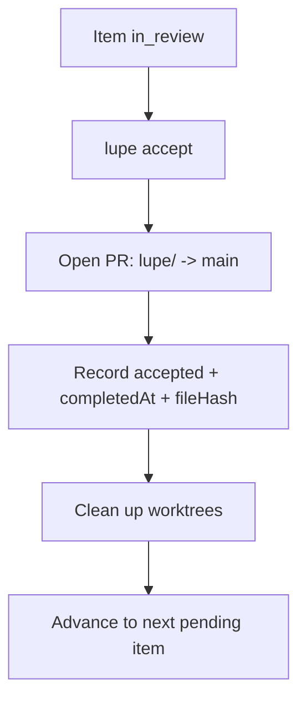

# Phase 08 — Accept & Queue Lifecycle

## Goal

Implement the highest-stakes operations: accepting a reviewed work item (open a
PR, record acceptance, advance the queue), rejecting/skipping items, the
halt-on-reject queue policy, the immutability rule for accepted files plus
`acknowledge`, and worktree cleanup. This completes the end-to-end queue
lifecycle.

## Scope

In:

- `lupe accept`: open a PR from `lupe/<id>` into `main`, record
  `accepted` + completion timestamp + `fileHash`, advance the queue.
- `lupe reject [reason]` and `lupe skip`.
- `onItemRejected: "halt"` queue policy.
- Immutability of accepted files + drift warning + `lupe acknowledge`.
- Worktree cleanup after accept/reject.

Out:

- `init`/`migrate`/`new` onboarding and packaging (Phase 09).

## Accept / merge contract



Lupe never pushes directly to `main`; acceptance always goes through a PR.

## Key modules / files

```txt
src/cli/commands/accept.ts         # open PR, record, advance
src/cli/commands/reject.ts         # mark rejected, apply policy
src/cli/commands/skip.ts           # mark skipped, advance
src/cli/commands/acknowledge.ts    # re-hash an accepted file
src/lifecycle/accept.ts            # accept orchestration
src/lifecycle/advance.ts           # queue advancement / halt
src/lifecycle/immutability.ts      # accepted-file drift detection
src/git/pr.ts                      # PR provider adapter (e.g. gh)
```

## Tasks

1. Implement the PR adapter (e.g. `gh`-based) to open a PR from the integration
   branch into `main`; make it an interface so tests inject a fake.
2. Implement `lupe accept`: verify the item is `in_review` (or honor
   `autoAccept`), open the PR, record `accepted` + `completedAt` + `fileHash` in
   `state.json`, clean up worktrees, and advance the queue.
3. Implement `lupe reject [reason]`: mark `rejected`, record the reason, and
   apply `onItemRejected` (default `halt`) so the queue stops advancing.
4. Implement `lupe skip`: mark `skipped` and advance.
5. Implement immutability: on discovery, compare each accepted item's current
   hash to the stored `fileHash`; on drift, warn and recommend a new item or
   `acknowledge`.
6. Implement `lupe acknowledge <id>`: re-hash an accepted file after a
   non-substantive edit without re-running it.
7. Ensure rejected/skipped files become editable again per the reject policy.
8. Clean up `.lupe/worktrees/<id>/...` after accept or reject.

## Acceptance criteria

- `lupe accept` opens a PR into `main` (never a direct push), records acceptance
  details, cleans up worktrees, and advances the queue.
- `lupe reject` halts the queue under the default policy; `lupe skip` advances.
- Editing an accepted file triggers a drift warning recommending a new item or
  `acknowledge`; `acknowledge` clears it by re-hashing.
- State and `STATE.md` reflect every lifecycle transition.
- `typecheck`, `lint`, and `test` all pass.

## Verification

```bash
bun run typecheck
bun run lint
bun test
```

- Integration test (fake PR provider + temp git repo): accept opens a PR,
  records state, cleans worktrees, advances; reject halts; skip advances.
- Unit tests: immutability drift detection, `acknowledge` re-hash, advancement
  vs halt logic.

## Dependencies

- Phase 02 (file hashing).
- Phase 03 (state, transitions, queue effects).
- Phase 07 (integration branch + review package consumed by accept).
